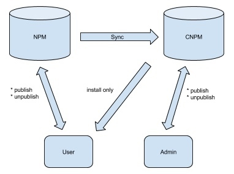
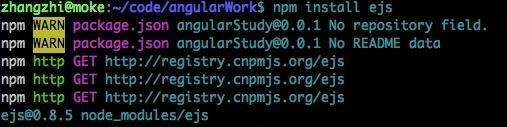

# [转+] npm 更换源使用国内镜像



为什么要换源? npm 官方站点 [http://www.npmjs.org/](http://www.npmjs.org/) 并没有被墙,但是下载第三方依赖包的速度让人着急啊!
就拿阿里云环境来说,有时 npm 一个包也需要耐心等待......等待过去也许是原地踏步,也许就是安装失败.
幸运的是,国内有几个镜像站点可以供我们使用

-   [http://www.cnpmjs.org/](http://www.cnpmjs.org/)
-   [https://npm.taobao.org/](https://npm.taobao.org/)

速度非常快,镜像站会实时更新,为我们节省了好多时间.如何给本机换源呢?
(1)[临时]通过 config 配置指向国内镜像源

```shell
# 配置指向源
# cnpmjs.org
$ npm config set registry https://registry.cnpmjs.org
# npm.taobao.org
$ npm config set registry https://registry.npm.taobao.org
```

(2)[临时]通过 npm 命令指定下载源

```shell
# 在安装时候临时指定
$ npm --registry https://registry.cnpmjs.org info express
```

(3)[linux]在配置文件 ~/.npmrc 文件写入源地址

```shell
# 打开配置文件
$ vim ~/.npmrc
# 写入配置文件
registry=https://registry.npm.taobao.org/
```

推荐使用最后一种方法,一劳永逸,前面 2 钟方法都是临时改变包下载源.
如果你不想使用国内镜像站点,只需要将 写入 ~/.npmrc 的配置内容删除即可.
下面是我本地下载 ejs 包的截图,可以看到默认源地址指向了 cnpm



(4) 使用 `cnpm` 来替代 `npm`

```shell
$ npm install -g cnpm --registry=http://registry.npm.taobao.org
```

或者 (linux 专用)

```shell
alias cnpm="npm --registry=http://registry.npm.taobao.org \
--cache=$HOME/.npm/.cache/cnpm \
--disturl=http://registry.npm.taobao.org/mirrors/node \
--userconfig=$HOME/.cnpmrc"

#Or alias it in .bashrc or .zshrc
$ echo '\n#alias for cnpm\nalias cnpm="npm --registry=http://registry.npm.taobao.org \
  --cache=$HOME/.npm/.cache/cnpm \
  --disturl=http://registry.npm.taobao.org/mirrors/node \
  --userconfig=$HOME/.cnpmrc"' >> ~/.zshrc && source ~/.zshrc
```

通过 cnpm 命令行, 你可以快速同步任意模块:

```shell
$ cnpm sync koa connect mocha
```

呃, 我就是不想安装 `cnpm cli` 怎么办? 哈哈, 早就想到你会这么懒了, 于是我们还有一个 web 页面:
例如我想马上同步 koa, 直接打开浏览器: [http://npm.taobao.org/sync/koa](http://npm.taobao.org/sync/koa)
或者你是命令行控, 通过 open 命令打开:

```
open http://npm.taobao.org/sync/koa
```

如果你安装的模块依赖了 C++ 模块, 需要编译, 肯定会通过 [node-gyp](https://github.com/TooTallNate/node-gyp) 来编译, [node-gyp](https://github.com/TooTallNate/node-gyp) 在第一次编译的时候, 需要依赖 [node](http://nodejs.org/) 源代码, 于是又会去 node dist 下载, 于是大家又会吐槽, 怎么 npm 安装这么慢...
好吧, 于是又要提到 `--disturl`参数, 通过中国镜像来下载:

```shell
$ npm install microtime \
  --registry=http://registry.npm.taobao.org \
  --disturl=http://npm.taobao.org/mirrors/node
```

再次要提到 cnpm cli, 它已经默认将 `--registry` 和 `--disturl` 都配置好了, 谁用谁知道 . 写到这里, 就更快疑惑那些不想安装 `cnpm cli` 又吐槽 `npm` 慢的同学是基于什么考虑不在本地安装一个 `cnpm` 呢?

**nodejs 源码路径**
对于在淘宝上下载 nodejs 源码指定的地址是: `[https://npm.taobao.org/dist](https://npm.taobao.org/dist)`

**直接更改源文件中的配置文件地址来更改加载路径**
`~/node_modules/npm/lib/config/defaults.js`
Line : 181
`registry : "https://registry.npmjs.org/"`
将这个注册地址 更改为: `[https://registry.npm.taobao.org/](https://registry.npm.taobao.org/)`

### Nodejs Release 镜像使用帮助

Nodejs Release 为各平台提供预编译的 nodejs 和 npm 等二进制文件，是 [https://nodejs.org/dist/](https://nodejs.org/dist/) 的镜像。

使用方法
可以手工选择下载所需的版本，也可以搭配 n 使用，方法如下：

```
# 设定环境变量
export NODE_MIRROR=http://npm.taobao.org/mirrors/node

# 然后正常使用 n 即可
sudo n stable
```

参考网站:

-   [快速搭建 Node.js / io.js 开发环境以及加速 npm](http://fengmk2.com/blog/2014/03/node-env-and-faster-npm.html)
-   [给电脑换源 npm 国内镜像 cnpm](http://yijiebuyi.com/blog/b12eac891cdc5f0dff127ae18dc386d4.html)
