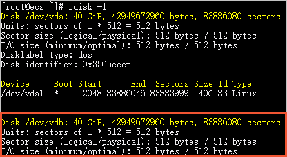
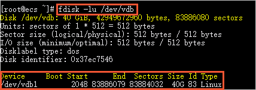
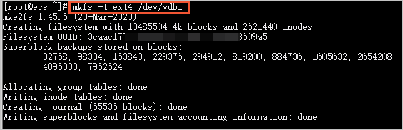
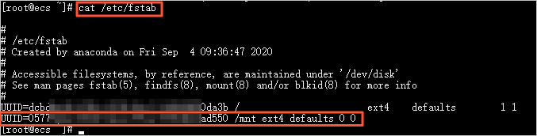

# Aliyun 盘挂载/扩容

## 数据盘挂载

原文链接: [分区格式化数据盘（Linux）](https://help.aliyun.com/document_detail/25426.html)
适用系统：Linux（Redhat , CentOS，Debian，Ubuntu）
Linux 的云服务器数据盘未做分区和格式化，可以根据以下步骤进行分区以及格式化操作。下面的操作将会把数据盘划分为一个分区来使用。

### 1. 查看

查看数据盘在没有分区和格式化数据盘之前，使用 `df –h` 命令，是无法看到数据盘的，可以使用 `fdisk -l` 命令查看。如下图：



友情提示：若您执行 `fdisk -l` 命令，发现没有 `/dev/xvdb` 标明您的云服务无数据盘，那么您无需进行挂载，此时该教程对您不适用

### 2. 分区 / 格式化

运行以下命令对数据盘进行分区。

```bash
$ fdisk -u /dev/vdb
```

输入 `p` 查看数据盘的分区情况。
本示例中，数据盘没有分区。
输入 `n `创建一个新分区。
输入 `p` 选择分区类型为主分区。

> 创建一个单分区数据盘可以只创建主分区。如果要创建四个以上分区，您应该至少选择一次 e（extended），创建至少一个扩展分区。

输入分区编号，按回车键。
本示例中，仅创建一个分区，直接按回车键，采用默认值 1。
输入第一个可用的扇区编号，按回车键。
本示例中，直接按回车键，采用默认值 2048。
输入最后一个扇区编号，按回车键。
本示例中，仅创建一个分区，直接按回车键，采用默认值。
输入`p` 查看该数据盘的规划分区情况。
输入 `w` 开始分区，并在完成分区后退出。


查看新的分区运行以下命令。

```bash
$ fdisk -lu /dev/vdb
```



格式化新分区使用以下对新分区进行格式化，格式化的时间根据硬盘大小有所不同。

```bash
$ mkfs -t ext4 /dev/vdb1
```



### 3. 挂载

**挂载到指定文件夹**

```
# 创建文件夹
$ mkdir /webdata
```

> 如果需要把数据盘单独挂载到某个文件夹，比如单独用来存放网页, 需要先创建文件夹可以修改命令中的`/mnt`部分为文件夹目录

添加分区信息, 实现开机自动挂载使用如下命令写入新分区信息

```bash
$ echo `blkid /dev/vdb1 | awk '{print $2}' | sed 's/\"//g'` /webdata ext4 defaults 0 0 >> /etc/fstab
```

然后使用 `cat /etc/fstab` 命令查看，出现以下信息就表示写入成功。



挂载新分区使用`mount -a`
命令挂载新分区，然后用 `df -h` 命令查看，出现以下信息就说明挂载成功，可以开始使用新的分区了。
​

## 在线扩容磁盘

1、您先登录服务器执行 `yum install -y cloud-utils-growpart` 安装扩容工具
2、运行以下命令扩容分区。

```bash
# /dev/vda和1之间需要空格分隔
$ growpart /dev/vda 1
```

3、执行以下命令

```bash
# /dev/vda和1之间不要带空格
$ resize2fs /dev/vda1
```

​

4、运行以下命令检查扩容后结果。

```bash
$ df -Th
```

### 常见问题

1. unexpected output in sfdisk --version [sfdisk，来自 util-linux 2.23.2]

```bash
# 输出之前的 $LANG 命令
$ echo $LANG
zh_CN.UTF-8

# 切换语言
$ LANG=en_US.UTF-8

# or
$ export LC_ALL=en_US.UTF-8
# or
$ localectl set-locale LANG=en_US.UTF-8
# or
$ export LANGUAGE=en_US.UTF-8
```

当成功扩容之后需要切回到原来的语言包
​

```bash
$ LANG=zh_CN.UTF-8
```

切换语言前后对比

```shell
$ df -Th
Filesystem     Type      Size  Used Avail Use% Mounted on
devtmpfs       devtmpfs   16G     0   16G   0% /dev
tmpfs          tmpfs      16G     0   16G   0% /dev/shm
tmpfs          tmpfs      16G  8.6M   16G   1% /run
tmpfs          tmpfs      16G     0   16G   0% /sys/fs/cgroup
/dev/vda1      ext4       99G   29G   65G  31% /
/dev/vdb1      ext4      296G  201G   80G  72% /storage
tmpfs          tmpfs     3.1G     0  3.1G   0% /run/user/1001
$ LANG=zh_CN.UTF-8
$ df -h
文件系统        容量  已用  可用 已用% 挂载点
devtmpfs         16G     0   16G    0% /dev
tmpfs            16G     0   16G    0% /dev/shm
tmpfs            16G  8.6M   16G    1% /run
tmpfs            16G     0   16G    0% /sys/fs/cgroup
/dev/vda1        99G   29G   65G   31% /
/dev/vdb1       296G  201G   80G   72% /storage
tmpfs           3.1G     0  3.1G    0% /run/user/1001
```
