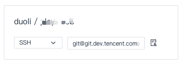

# Git 代码使用 ssh 进行无密码更新

所谓部署， 我的理解就是在用户保证代码质量的前提下, 将代码能够快速的自动部署到目标服务器上的一种手段.


## 生成并且部署公钥

具体步骤参照 [配置SSH公钥](https://coding.net/help/doc/git/ssh-key.html)

### 1) 生成公钥

```bash
# 使用给定的 email 生成 public/private rsa 密钥
# 需要配置 .ssh/config
$ ssh-keygen -t rsa -b 4096 -C "your_email@example.com"
```

### 2) 在 coding 中添加公钥

输出部署公玥

```
$ cat coding.pub
```

在git 管理端部分部署公钥


### 3) 配置 config 文件

编辑 `~/.ssh/config` 文件

```
# way 1
Host coding                               
    HostName git.coding.net
    User duoli
    IdentityFile ~/.ssh/coding_rsa

# way 2
Host git.coding.net                               
    User duoli
    IdentityFile ~/.ssh/coding_rsa
```

> Host : 主机的简称
> HostName : 主机真实名称
> User : 用户名
> IdentityFile : 私钥位置


### 4) 测试是否可以链接到 [git@git.coding.net](mailto:git@git.coding.net) 服务器

```php
# 注意 git.coding.net 接入到 CDN 上所以会解析多个不同的 host ip 
$ ssh -T git@coding
The authenticity of host 'git.coding.net (123.59.85.184)' can't be established.

RSA key fingerprint is 98:ab:2b:30:60:00:82:86:bb:85:db:87:22:c4:4f:b1.

Are you sure you want to continue connecting (yes/no)? 

# 这里我们根据提示输入 yes
Warning: Permanently added 'git.coding.net,123.59.85.184' (RSA) to the list of known hosts.

Coding 提示: Hello duoli, You've connected to Coding.net via SSH. This is a deploy key.

duoli，你好，你已经通过 SSH 协议认证 Coding.net 服务，这是一个部署公钥
```

这样便算是连接成功

### 5) 克隆代码

在 coding 网站找到 ssh 对应地址(忽略地址, 最近tencent 和 coding 正在合并)




```
$ git clone git@git.dev.tencent.com:user/project.git
```

这样便可以进行代码的无密码更新了
