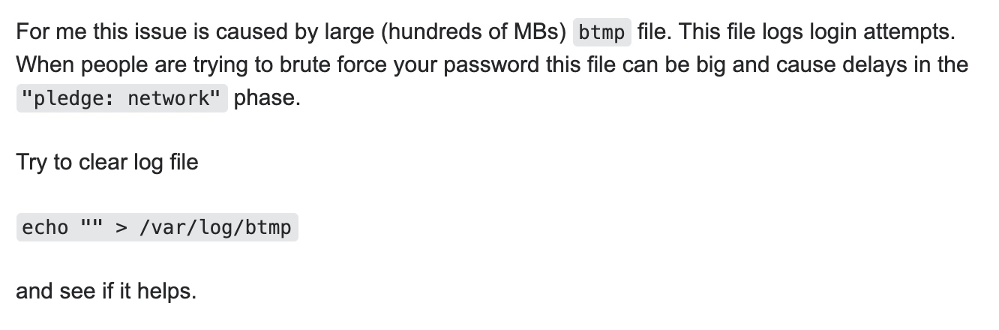

# ssh 登录慢，卡顿在 pledge: network 之后

当 ssh 登录缓慢的时候我们需要 使用 

```
$ ssh -v user@host
```

来查看问题出现的原因, 根据出现的问题来进行处理

我这里出现的问题是在 `pledge: network` 之后出现卡顿

处理结果

```
$ echo "" > /var/log/btmp
```

主要原因是 22 端口对外暴露，导致大量的爆破扫描，因此导致 btmp 这个文件巨大

参考地址 : [ssh connection takes forever to initiate, stuck at “pledge: network”](https://serverfault.com/questions/792486/ssh-connection-takes-forever-to-initiate-stuck-at-pledge-network)




我们可以通过如下命令查看恶意ip试图登录次数：

```
lastb | awk ‘{ print $3}’ | sort | uniq -c | sort -n
```