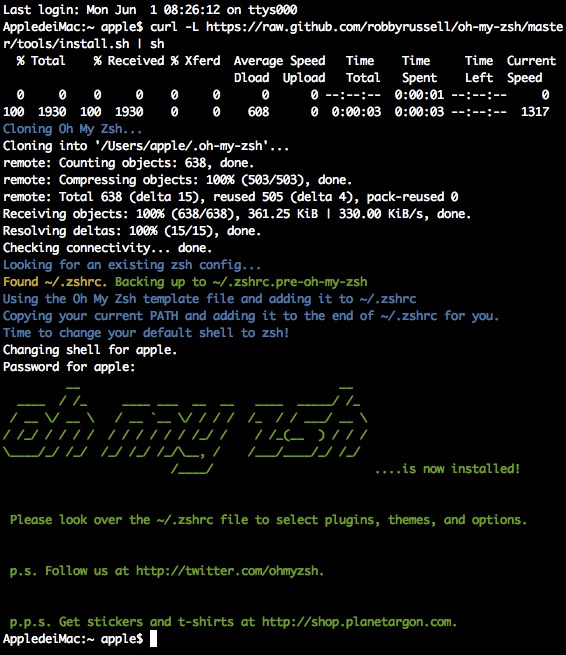
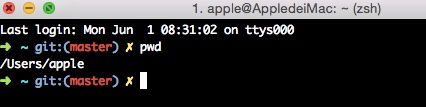
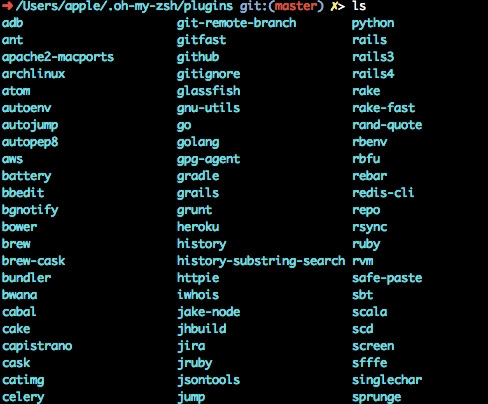
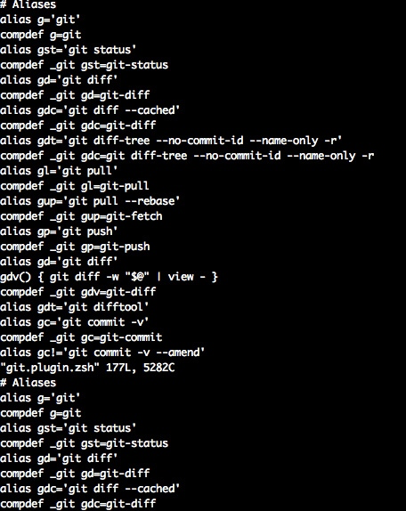
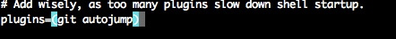
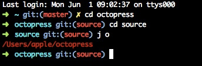
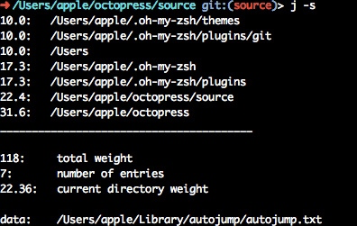
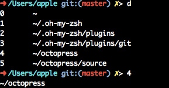
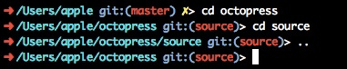
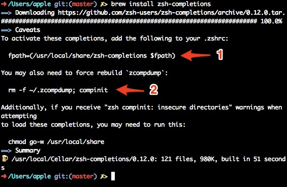

# [转] Mac-zsh 安装和使用

原文地址: [Mac-zsh 安装和使用(原创)](https://cnbin.github.io/blog/2015/06/01/mac-zsh-an-zhuang-he-shi-yong/)

首先，我们知道，shell 有很多种：可以通过命令 `cat /etc/shells` 可以查看系统支持哪些 shell：

```
# List of acceptable shells for chpass(1).
# Ftpd will not allow users to connect who are not using
# one of these shells.

/bin/bash
/bin/csh
/bin/dash
/bin/ksh
/bin/sh
/bin/tcsh
```

`Zsh`全称为 `Z Shell`，因为 `Z` 是最后一个字母，因此大家称之为——`终极 Shell`。

## Oh My Zsh 安装

`Linux/Unix` 默认都是使用 `Bash(Bourne-again Shell)`，使用 `zsh`，由于配置过于复杂，前期很少人使用，但后来有外国程序员弄出一个 [Oh My ZSH](http://ohmyz.sh/) 来管理 `zsh` 的配置和支持更多插件，使得 `zsh` 变得更容易使用和更加强大。

### curl 方式

```
curl -L https://raw.github.com/robbyrussell/oh-my-zsh/master/tools/install.sh | sh
```

### wget 方式

```
wget https://raw.github.com/robbyrussell/oh-my-zsh/master/tools/install.sh -O - | sh
```

安装完之后，关闭当前终端，并重新打开一个，`oh my zsh`的默认主题是 `robbyrussel`。

如下图所示：



安装完成之后退出当前会话重新打开一个终端窗口，你就可以见到这个彩色的提示了：



## 配置

`oh my zsh`提供数十种主题，相关文件在 `~/.oh-my-zsh/themes` 目录，可以编辑主题来满足自身需求，我是使用默认的`robbyrussell`，但是做了一些修改：

```
PROMPT='%{$fg_bold[red]%}➜ %{$fg_bold[green]%}%p%{$fg[cyan]%}%d %{$fg_bold[blue]%}$(git_prompt_info)%{$fg_bold[blue]%}% %{$reset_color%}> '
#PROMPT='${ret_status}%{$fg_bold[green]%}%p %{$fg[cyan]%}%c %{$fg_bold[blue]%}$(git_prompt_info)%{$fg_bold[blue]%} % %{$reset_color%}> '
```

与原来不同的是，将 `c`(表示当前目录)改为 `d`(表示绝对路径)，另外在尾部添加一个 `>` 作为隔离符号，效果如下：


### 切換 theme

所有的主題都放在 `~/.oh-my-zsh/themes` 目录中，先看一下有哪些可以用：

```
 ~/ [master*] ls ~/.oh-my-zsh/themes
3den.zsh-theme                junkfood.zsh-theme
Soliah.zsh-theme              kafeitu.zsh-theme
adben.zsh-theme               kardan.zsh-theme
af-magic.zsh-theme            kennethreitz.zsh-theme
afowler.zsh-theme             kiwi.zsh-theme
agnoster.zsh-theme            kolo.zsh-theme
alanpeabody.zsh-theme         kphoen.zsh-theme
amuse.zsh-theme               lambda.zsh-theme
apple.zsh-theme               linuxonly.zsh-theme
arrow.zsh-theme               lukerandall.zsh-theme
aussiegeek.zsh-theme          macovsky-ruby.zsh-theme
avit.zsh-theme                macovsky.zsh-theme
awesomepanda.zsh-theme        maran.zsh-theme
bira.zsh-theme                mgutz.zsh-theme
blinks.zsh-theme              mh.zsh-theme
bureau.zsh-theme              michelebologna.zsh-theme
candy-kingdom.zsh-theme       mikeh.zsh-theme
candy.zsh-theme               miloshadzic.zsh-theme
clean.zsh-theme               minimal.zsh-theme
cloud.zsh-theme               mira.zsh-theme
crcandy.zsh-theme             mortalscumbag.zsh-theme
crunch.zsh-theme              mrtazz.zsh-theme
cypher.zsh-theme              murilasso.zsh-theme
dallas.zsh-theme              muse.zsh-theme
darkblood.zsh-theme           nanotech.zsh-theme
daveverwer.zsh-theme          nebirhos.zsh-theme
dieter.zsh-theme              nicoulaj.zsh-theme
.
.
.
```

切换方式是修改 `.zshrc` 的 `ZSH_THEME` 这个参数，预设是 `robbyrussell`，如果想改成 `apple.zsh-theme`，那么请把 `ZSH_THEME` 改为 `apple`：

```
 # Set name of the theme to load.
 # Look in ~/.oh-my-zsh/themes/
 # Optionally, if you set this to "random", it'll load a random theme each
 # time that oh-my-zsh is loaded.
 ZSH_THEME="apple"
```

这里有一些 [theme](https://github.com/robbyrussell/oh-my-zsh/wiki/themes) 的截图，如果不想一个一个來看效果，可以參考看看。

## zsh 的改进方法

-   你可以打开 `auto_pushd` 选项(通过命令 `setopt auto_pushd` ），这样你通过 `cd` 切换目录时，`zsh` 会自动将前一个目录加到栈里，这样你就不会因为忘记 `pushd` 而遗憾了;

-   `bash` 里面可以`cd -` 回到上一个目录（即最后一次调用 `cd` 时所在的目录），但 zsh 里面有 `cd -2`, `cd +3` 这样的用法，并且在输入 `cd -` 之后按 `TAB` 能够列出目录名供挑选补全。不过需要注意的是，这里 `-2` 并不表示倒数第二次调用 `cd` 时的目录，而是倒数第二次通过 `pushd` 记录的目录，如果打开了 `auto_pushd` 选项，那么这两个的含义倒是一样的;

-   `zsh` 里面将 `~` 这个符号的用法进行了扩展，我们可以用 `hash -d www=/var/www/html` 定义一个路径别名，然后用 `cd ~www` 就可以进入到 `/var/www/html` 了。我在配置 XAMPP 的 mysql 中，就用到了 `hash -d myserver=/Applications/XAMPP/xamppfiles/bin/mysql.server` ,配置 XAMPP 启动路径为 `hash -d myxampp=/Applications/XAMPP/xamppfiles/xampp`。

### 插件

`oh my zsh` 提供丰富的插件，存放在 `~/.oh-my-zsh/plugins` 目录下：



想了解每个插件的功能以及如何使用，只要打开相关插件的目录下 `zsh` 文件即可，以 `git` 插件为例：


显示如下：



打开 `git.plugin.zsh` 文件，里面有很多命名别来来简化命令的输入。您可以根据自己的需要来启用哪些插件，只需在 `~/.zshrc` 配置文件追加内容即可：

```
plugins=(git autojump osx)
```

### 常用插件的使用：

#### 1.git：

当您处在一个 `git` 受控的目录下时，`Shell` 明确显示 `git` 和 `branch` 信息，另外简化 `git` 很多命令，具体使用请参考： [Plugin:git](https://github.com/robbyrussell/oh-my-zsh/wiki/Plugins)

#### 2.autojump

`autojump` 智能跳转，通过 `zsh` 记录访问过的目录，`autojump` 的简写 `j ＋ 目录名` ，随意的在目录间跳转，支持各种模糊匹配、补全，例如之前的 `cd work`；现在可以直接 `work`，或者 `j wor` 、 `j work` 达到同样的效果，节省大好的时间。

1.安装

如果你是 `Mac` 用户，跟我一样的话，可以使用 `brew` 安装即可：

```
brew install autojump
```

如果是 `Linux` 用户，首先下载 `autojump` 最新版本，执行命令：

```
git clone git://github.com/joelthelion/autojump.git
```

然后进入目录，执行

```
./install.py
```

最后将以下代码加入 `~/.zshrc` 配置文件：

```
[[ -s ~/.autojump/etc/profile.d/autojump.sh ]] && . ~/.autojump/etc/profile.d/autojump.sh
```

注意：关于 `zsh: command not found: j` 报错

请在 `.zshrc` 文件相应的位置，找到 `plugins=()` 这行,添加 `autojump` 记得各插件名之间用英文空格隔开

如下图：



2.使用

我之前打开过我的博客 `~/octopress/source` 目录，现在只需敲入 `j o` 就可以快速切换到 `~/ocotpress` 目录。

如下图：


利用 `j –s` 可以看你的历史路径库。



#### 3.osx

-   `tab` - 在一个新标签打开当前目录

-   `cdf` - cd 到当前 Finder 目录

-   `quick-look` - 快速浏览特殊的文件

-   `man-preview` - 在 Preview 应用打开特定的 man page

-   `trash` - 将特定的文件移到垃圾桶

使用：

1.各种补全：除了支持命令补全和文件补全之外，还支持命令参数补全，插件内容补全，只需要按 `tab` 键

2.目录浏览和跳转：输入 `d`，就显示在会话里访问的目录列表，输入列表前的序号，即可以跳转



3.输入 `..` 可以返回到上级目录



### 安装 zsh-comopletions

安裝：

```
$ brew install zsh-completions
```



要启用还需要打开你的 `.zshrc` 加入以下两行来纳入 `zsh-completions` 的补全功能：

.zshrc

```
+# zsh-completions
+fpath=(/usr/local/share/zsh-completions $fpath)
```

同时还需要 `rebuild zsh` 的 `.zcompdump`

```
$ rm -f ~/.zcompdump; compinit
```

### 转换过程中可能遇到的一些问题

#### 1.alias

如果你本來就有設定一些 alias 在你的 `.bashrc`，你又把這些設定直接套用到 `.zshrc`，那有機會有一些指令會變怪怪的，這有可能是你設定的 alias 與 oh-my-zsh 內建的衝到了。oh-my-zsh 內建的 alias 放在 `~/.oh-my-zsh/lib/aliases.zsh`，內容如下：

aliases.zsh

```
# Push and pop directories on directory stack

alias pu='pushd'
alias po='popd'

# Basic directory operations

alias ...='cd ../..'
alias -- -='cd -'

# Super user

alias _='sudo'
alias please='sudo'

#alias g='grep -in'

# Show history

if [ "$HIST_STAMPS" = "mm/dd/yyyy" ]
then
    alias history='fc -fl 1'
elif [ "$HIST_STAMPS" = "dd.mm.yyyy" ]
then
    alias history='fc -El 1'
elif [ "$HIST_STAMPS" = "yyyy-mm-dd" ]
then
    alias history='fc -il 1'
else
    alias history='fc -l 1'
fi
# List direcory contents

alias lsa='ls -lah'
alias l='ls -la'
alias ll='ls -l'
alias la='ls -lA'
alias sl=ls # often screw this up

alias afind='ack-grep -il'
```

建议要在 `.zshrc` 加上自己的 alias 前先确认看看這個档案裡是不是有一些 alias 会跟你的冲突。

#### 2.bash-completion

如果你跟我一样用 bash 时有装 bash-completion，而且又沒仔細弄清楚就把 `.bashrc` 的內容一般会套用在 `.zshrc` 上，那么当你开一个新的 shell 时有可能会发现遇到以下的信息：

```
  .
  .
  .
/usr/local/etc/bash_completion:138: command not found: complete
/usr/local/etc/bash_completion:141: command not found: complete
/usr/local/etc/bash_completion:144: command not found: complete
/usr/local/etc/bash_completion:147: command not found: complete
/usr/local/etc/bash_completion:150: command not found: complete
/usr/local/etc/bash_completion:153: command not found: complete
/usr/local/etc/bash_completion:156: command not found: complete
/usr/local/etc/bash_completion:159: command not found: complete
/usr/local/etc/bash_completion:162: command not found: complete
/usr/local/etc/bash_completion:246: parse error near `]]'
```

这是因为在安裝 bash-completion 的时候，原則上都会加入以下內容在你的 `.bashrc`：

.bashrc

```
if [ -f $(brew --prefix)/etc/bash_completion ]; then
    . $(brew --prefix)/etc/bash_completion
fi
```

以上指令会去 `source bash_completion` 的內容，而 bash_completion 里面使用了 [bash completion buitins](http://www.gnu.org/software/bash/manual/html_node/Programmable-Completion-Builtins.html) 中的 `complete` 這個指令，所以如果你的 `.zshrc` 也去 `source bash_completion`，那就会 show 出像上面的 `command not found: complete` 这种信息了。所以记得在 `.zshrc` 中不要加入这段 code。

### Resource Reference

-   [http://icarus4.logdown.com/](http://icarus4.logdown.com/)
-   [http://www.cnblogs.com/bamanzi/p/zsh-simple-guide.html](http://www.cnblogs.com/bamanzi/p/zsh-simple-guide.html)
