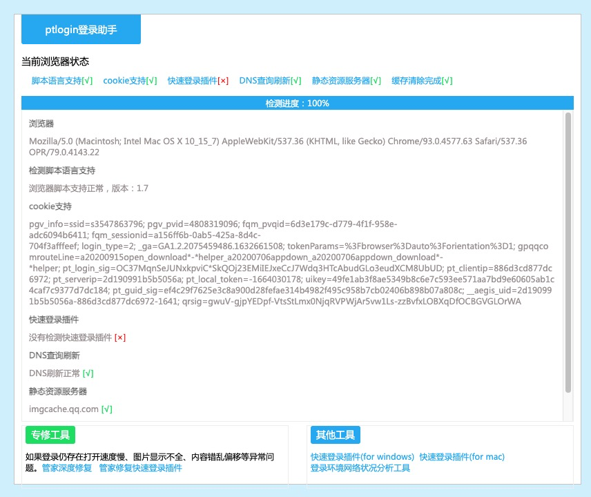

# 通过王者营地抓取王者数据

## 资料

**基础登录**

https://xui.ptlogin2.qq.com/ : 登录的说明

https://xui.ptlogin2.qq.com/assistant/troubleshooter.html : 这个网址是登录助手的地址



**QQLogo**

https://q.qlogo.cn/headimg_dl?dst_uin=1057538126&spec=640

https://q.qlogo.cn/headimg_dl?dst_uin={qq}&spec=640

## 应用

### 获取第一凭证

**入口**

> 通过此入口进行自动登录

https://xui.ptlogin2.qq.com/cgi-bin/xlogin?appid=716027609&pt_3rd_aid=1105200115&daid=381&pt_skey_valid=0&style=35&s_url=http%3A%2F%2Fconnect.qq.com&refer_cgi=m_authorize&ucheck=1&fall_to_wv=1&status_os=11&redirect_uri=auth%3A%2F%2Ftauth.qq.com%2F&client_id=1105200115&response_type=token&scope=all&sdkp=i&sdkv=3.5.3_full&status_machine=HUAWEI2300P&switch=1&h5sig=&loginty=1

**登录成功的代理页面**

> 登录成功跳转到此页面, 获取授权数据, 这里的授权数据用来获取第二凭证

https://imgcache.qq.com/open/connect/widget/mobile/login/proxy.htm?#&t=1634113064#&openid=B75CBDC928XXXXXXXXXXE78B4F793202&appid=1105200115&access_token=C95353EF3ABFBDA12A48D607AFCE9ADA&pay_token=DD03F57240A45EB2FDB1549026A58D6D&key=d5575f4f1055d0fb1968689b242f60a2&serial=&token_key=&browser=0&browser_error=0&status_os=11&sdkv=3.5.3_full&status_machine=HUAWEI2300P&update_auth=0&has_auth=1&auth_time=1634113041450&page_type=1&redirect_uri_key=713A4A803423112ECEEDE657A39910ED30A602D2E8F0417E88C213FFEE9E7E364329E571D17C047F7404C14A174AAF074FBFB35FF64D5A6C8E5161343D0ED0ADEC147206D34B3A62C8274F63AE34D9B23F2D168CAE3B7D564BFFA9EE94AF53211EC9AC5EAFFECF7CD2AF327544CA7F08140EE9483A48EDC71511B57AEA97C267759C8300F7083C2E4E72474AF7C61A2A1CFFAC7E79440C7290A17C0BC3AC4D6F4EF1E27E4D00E4CBE0F6E961302207CC716B2E4F16AB2339951C9FDD0E5AAA5FB26D5EA90B67EB70BB69ECFF681850C440CC0E903A42DB19C042A66ED31F0A512CF512A3BD8A0AC1963BE5524E8A8ED60589BD0F5A6ECB510DB9185453DE3AFCDF0D10AABE950A7E468EF1E5D41C49DBF9A8FA546ED1037E91D90D6306BC15A8E95682E5B90536FBF0962CCED66EC6D2

_params: 参数_

```
openid : B75CBDC928XXXXXXXXXXE78B4F793202
appid  : 1105200115
access_token : C95353EF3ABFBDA12A48D607AFCE9ADA
```

### 王者营地登录, 获取第二凭证

> 通过三方登陆信息进行登录, 这里使用 MAC 的 charles 进行抓包得到, 细节不细说

Url : https://ssl.kohsocialapp.qq.com:10001/user/login

这里发送的数据包含两部分

一部分是 Header, 另一部分是 Post 参数, 可以通过邮件 charles 复制 curl request 来获取到这个数据并进行解析, 以下所有的接口请求均和此接口类似

**Post 数据**

```
accessToken	C95353EF3ABFBDA12A48D607AFCE9ADA
avatar	http://thirdqq.qlogo.cn/g?b=oidb&k=RxwhyCoLHqztjjNt6xMISQ&s=40&t=1556321295
cChannelId	0
cClientVersionCode	57110121091573
cClientVersionName	5.71.101
cCurrentGameId	20001
cGameId	20001
cGzip	1
cRand	1634174723965
cSystem	ios
cSystemVersionCode	14.6
cSystemVersionName	iOS
delOldUser	0
gameAreaId	0
gameId	20001
gameOpenId
gameRoleId
gameServerId	0
gameUserSex	0
isTestFlight	0
key1	c8f9b1fb-3c27-444d-a728-95dba7a1ddd4
key10	3948838912
key11	ARM64
key13	WiFi
key14
key15	00000000-0000-0000-0000-000000000000
key18	iPhone11,6
key19	0.000000
key20	0.000000
key21
key22
key6	414
key7	896
key9	iPhone
loginType	openSdk
nickname	多厘
openId	B75CBDC928XXXXXXXXXXE78B4F793202
reportHashValue	10756235328
sex	1
userId	0
```

**返回数据**

```json
{
	"result": 0,
	"returnCode": 0,
	"returnMsg": "",
	"time": "175.9",
	"data": {
		"uin": "B75CBDC928XXXXXXXXXXE78B4F793202",
		"userId": "1842163274",
		"token": "JRNKfH8B",
		"new": false,
		"userSig": "eJxlkF1PwjAUhu-3K5pdG9fTraOQeDFkUaKFqEXXXXXXXXX7j0dZkL3qBfqJH6qIq8W42BAsAQX6db39YPJ71cTg__",
		"needAllUin": true,
		"time": 1634174724,
		"sex": 1,
		"avatar": "http://thirdqq.qlogo.cn/qqapp/1105200115/B75CBDC928XXXXXXXXXXE78B4F793202/100",
		"platformAvatar": "http://thirdqq.qlogo.cn/qqapp/1105200115/B75CBDC928XXXXXXXXXXE78B4F793202/100",
		"userName": "\u591a\u5398",
		"userPhone": "152****9156",
		"dCode": "",
		"unbind": [],
		"forceChangeName": 0,
		"forceBindPhone": 0,
		"bigAvatar": "http://thirdqq.qlogo.cn/qqapp/1105200115/B75CBDC928XXXXXXXXXXE78B4F793202/160",
		"snsnickname": "\u591a\u5398",
		"guideInfo": [...],
		"youthPrivacyStatus": {
			"isAdult": 0,
			"mode": 0,
			"layer": 0
		}
	}
}
```

### 获取信息接口

**获取用户信息(openmobile)**

> 这里用于后续用户的登录或者是没有用户的营地注册

https://openmobile.qq.com/user/get_simple_userinfo?format=json&status_version=14&openid=B75CBDC928XXXXXXXXXXE78B4F793202&status_machine=iPhone11%2C6&oauth_consumer_key=1105200115&status_os=14.6&sdkv=3.3.6_lite&access_token=C95353EF3ABFBDA12A48D607AFCE9ADA&sdkp=i

```
{
	"ret": 0,
	"msg": "",
	"is_lost": 0,
	"nickname": "多厘",
	"gender": "男",
	"gender_type": 1,
	"province": "山东",
	"city": "济南",
	"year": "1986",
	"constellation": "",
	"figureurl": "http:\/\/qzapp.qlogo.cn\/qzapp\/1105200115\/B75CBDC928XXXXXXXXXXE78B4F793202\/30",
	"figureurl_1": "http:\/\/qzapp.qlogo.cn\/qzapp\/1105200115\/B75CBDC928XXXXXXXXXXE78B4F793202\/50",
	"figureurl_2": "http:\/\/qzapp.qlogo.cn\/qzapp\/1105200115\/B75CBDC928XXXXXXXXXXE78B4F793202\/100",
	"figureurl_qq_1": "http://thirdqq.qlogo.cn/g?b=oidb&k=RxwhyCoLHqztjjNt6xMISQ&s=40&t=1556321295",
	"figureurl_qq_2": "http://thirdqq.qlogo.cn/g?b=oidb&k=RxwhyCoLHqztjjNt6xMISQ&s=100&t=1556321295",
	"figureurl_qq": "http://thirdqq.qlogo.cn/g?b=oidb&k=RxwhyCoLHqztjjNt6xMISQ&s=640&t=1556321295",
	"figureurl_type": "1",
	"is_yellow_vip": "0",
	"vip": "0",
	"yellow_vip_level": "0",
	"level": "0",
	"is_yellow_year_vip": "0"
}
```

**获取用户信息(营地)**

Url : https://ssl.kohsocialapp.qq.com:10001/user/getuserinfo

这里通过第二授权的 token / openid 来获取用户的详细信息

**Resp**

```
{
	"result": 0,
	"returnCode": 0,
	"returnMsg": "",
	"time": "36.4",
	"data": {
		"nickname": "\u591a\u5398",
		"sex": 1,
		"avatar": "http:\/\/thirdqq.qlogo.cn\/qqapp\/1105200115\/B75CBDC928XXXXXXXXXXE78B4F793202\/100",
		"userLevel": 3,
		"userId": 1842163274
		...
	}
}

```

**获取游戏信息(营地)**

Url : https://ssl.kohsocialapp.qq.com:10001/game/setting

> 同样使用 Header / Form

**Resp(信息太多)**

```json
{
	"result": 0,
	"returnCode": 0,
	"returnMsg": "",
	"time": "44.9",
	"data": {
		"games": [
			{
				"name": "\u738b\u8005\u8363\u8000",
				"id": 20001,
				"icon": "http://yoyo.qq.com/icon/20160317113804.png",
				"icon2": "http://yoyo.qq.com/icon/20160615123216.jpg",
				"icon3": "",
				"chat": true,
				"role": true,
				"menu": true,
				"background": "http://yoyo.qq.com/background/20160317122846.jpg",
				"param": "{\"commentDomain\":\"sgame.coral.qq.com\",\"friendReq\":1,\"openMoment\":1,\"changeRole\":1}",
				"chatText": "",
				"shortDesc": "123232323",
				"menuInfo": [{}, {}],
				"sideInfo": [],
				"sHotKey": {
					"prefix": "",
					"hotkey": "\u59b2\u5df1\u79d2\u6740\u76ae\u80a4"
				}
			}
		],
		"maxUinCount": 5
		// ...
	}
}
```

**获取 Uin(营地)**

Url : https://ssl.kohsocialapp.qq.com:10001/user/alluin

> 可能获取游戏的 OpenID

```
{
	"result": 0,
	"returnCode": 0,
	"returnMsg": "",
	"time": "6.6",
	"data": [{
		"gameId": 20001,
		"uin": "B75CBDC928XXXXXXXXXXE78B4F793202",
		"isMainUin": true,
		"icon": "http:\/\/thirdqq.qlogo.cn\/qqapp\/1105200115\/B75CBDC928XXXXXXXXXXE78B4F793202\/100",
		"nickname": null
	}]
}
```

**获取角色(Roles)**

可能有关联的数据 : gameOpenId 和用户角色相关

Url : https://ssl.kohsocialapp.qq.com:10001/game/chatroles

**Resp**

```
{
    "result": 0,
    "returnCode": 0,
    "returnMsg": "",
    "time": "44.2",
    "data": {
        "roles": [
            {
                "uin": "B75CBDC928XXXXXXXXXXE78B4F793202",
                "isMainUin": true,
                "icon": "http://thirdqq.qlogo.cn/qqapp/1105200115/B75CBDC928XXXXXXXXXXE78B4F793202/100",
                "nickname": null,
                "gameId": "20001",
                "areaId": "1",
                "serverId": "1126",
                "roleId": "1124906535",
                "isMainRole": false,
                "add": 1,
                "common": 1,
                "vest": 0,
                "display": 1,
                "roleName": "多厘",
                "roleIcon": "http://q.qlogo.cn/qqapp/1104466820/9A2B0735B2620F0B52BC8962B433AEC6/100",
                "level": 6,
                "status": 1,
                "originalRoleId": "1843092194",
                "roleJob": "倔强青铜III",
                "openid": "9A2B0735B2620F0B52BC8962B433AEC6",
                "receive": 1,
                "onlineTime": 1634180314,
                "f": 1,
                "roleJobId": 1,
                "roleDesc": "手Q其他 青铜III",
                "battleGroupId": "",
                "areaName": "其他",
                "serverStatus": 3,
                "serverName": "手Q116区",
                "roleText": [
                    "其他手Q116区",
                    "倔强青铜III",
                    "Lv.6"
                ],
                "groupIds": [],
                "disLimit": [...],
                "menu": []
            }
        ],
        "groups": [],
        "showWX": false
    }
}
```

**获取英雄皮肤**

Url : https://ssl.kohsocialapp.qq.com:10001/play/h5getheroskinlist

**获取英雄列表**

Url : https://ssl.kohsocialapp.qq.com:10001/play/h5getherolist

### 通过营地 ID 获取到用户详细

营地 ID : 1874910711

流程和抓取数据一样, 找到用户的角色信息, 代入并获取用户的详细信息

## 参考文章

https://www.cnblogs.com/qiyeboy/p/9496262.html
https://cloud.tencent.com/developer/article/1351344
http://huazai.eleuu.com/?post=7
https://q.cnblogs.com/q/105900/
https://pibigstar.github.io/2019/09/22/QQ快速登录协议分析/
https://www.jianshu.com/p/03517d07ad84
https://www.iculture.cc/sg/pig=1267
